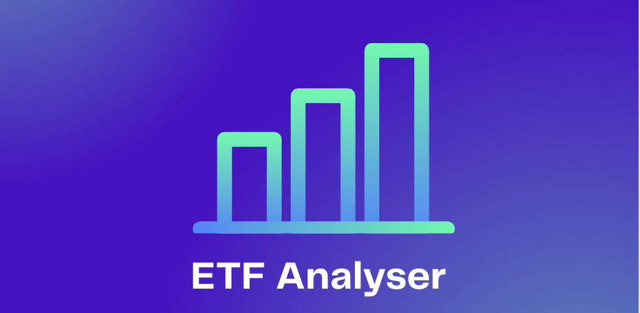
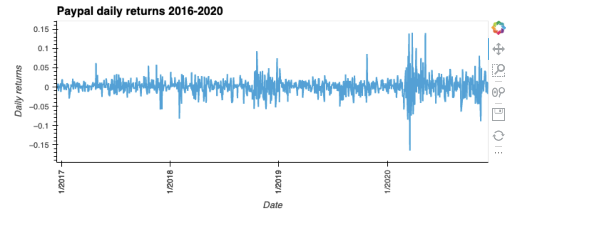
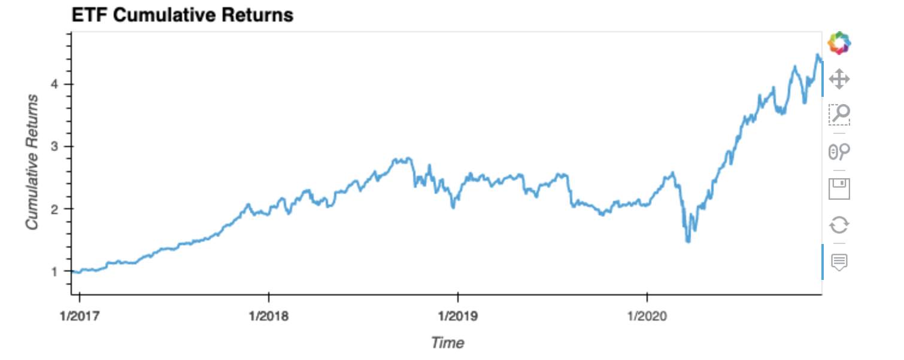

# ETF_analyser_app
Web application using SQL, Python and the Voilà library to analyze the performance of an ETF.

The main features of this application are:

* **Analyze a single asset in the ETF


* **Optimize data access with Advanced SQL queries

* **Analyze the ETF portfolio

* **Deploy the notebook as a web application


## Tecnologies required and installation guide:

* **SQL Alchemy

``` pip install SQLAlchemy```

* **Voilà

``` conda install -c conda-forge voila ```

## Instructions

Use the `etf_analyzer.ipynb` notebook to visualize and analyze the performance of any ETF.

Note that this application requires the use of hvPlot for the visualizations.

## Contributors

Jaime Aranda


---

## License

Licensed under the MIT License.
